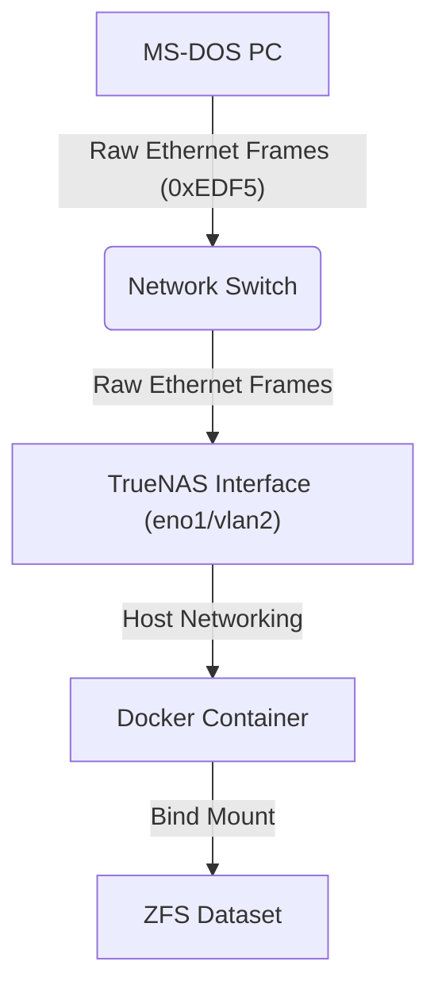

# EtherDFS Server for Docker

A lightweight, containerized version of the **EtherDFS Server** (`ethersrv-linux`), designed to run on NAS systems like **TrueNAS Scale**.

This image is built from the [oerg866/ethersrv-866](https://github.com/oerg866/ethersrv-866) fork, which is an actively maintained version of the original [EtherDFS by Mateusz Viste](http://etherdfs.sourceforge.net/).

## 📖 What is EtherDFS?
EtherDFS creates a **Layer 2 (Raw Ethernet)** drive mapping for MS-DOS clients. It allows an old PC (8086 to Pentium) to mount a folder from your modern NAS as a local drive letter (e.g., `E:`), without requiring a TCP/IP stack.



## ⚠️ Critical Networking Requirements

EtherDFS operates on **Layer 2**. It does **not** use IP addresses (no IP, no Subnet, no Gateway).

1. **Network Mode: Host**: You **MUST** use `network_mode: host`.
* Bridge mode or NAT will block the raw Ethernet frames.
* Port mapping (`-p 80:80`) is not applicable here.


2. **Physical Interface**: You must bind the application to the *actual* network interface of the host that is connected to the DOS machine's switch (e.g., `eno1`, `eth0`, `br0`, `vlan2`).

## 🚀 Usage

### Docker Compose / TrueNAS Scale "Custom App"

```yaml
services:
  etherdfs:
    image: ghcr.io/megapearl/etherdfs:latest
    container_name: etherdfs-server
    # CRITICAL: Must be host mode to receive raw frames
    network_mode: host
    # Capabilities needed to open raw sockets
    cap_add:
      - NET_RAW
      - NET_ADMIN
    volumes:
      # Format: /path/on/host:/path/in/container
      - /mnt/tank/retro/dos_games:/data
    # Command Syntax: ethersrv -f <INTERFACE> <PATH_WITHOUT_TRAILING_SLASH>
    # -f      : Keep in foreground (Required for Docker!)
    # vlan2   : Replace with your interface (check with 'ip addr')
    # /data   : The internal mount path
    command: /usr/local/bin/ethersrv -f vlan2 /data
    restart: unless-stopped

```

### Command Line Arguments

The entrypoint allows you to pass arguments directly to `ethersrv`:

| Argument | Description |
| --- | --- |
| `-f` | **Mandatory.** Runs the server in the foreground. Without this, the container will exit immediately. |
| `<interface>` | The network interface name on the host (e.g., `eth0`, `vlan2`). |
| `<path>` | The directory to serve. **Do not use a trailing slash** (e.g., use `/data`, not `/data/`). |

## 🔧 Troubleshooting & Common Issues

### 1. "Error: failed to scan dir" / Empty Drive on Client

This is almost always a **Permissions** issue on the Host (TrueNAS).

* **Cause:** The container runs as root, but TrueNAS NFSv4 ACLs might still block access.
* **Fix:** Ensure the underlying dataset is readable.
```bash
# Run on TrueNAS Shell
chmod -R 755 /mnt/tank/retro/dos_games

```


### 2. "Unknown drive" or Connection Drops

* **Cause:** The server cannot read a specific file or folder due to illegal characters or long filenames that confuse the translation layer.
* **Check:** Look at the logs (`docker logs etherdfs`). If you see `Error: failed to scan dir .../SomeLongPath`, that folder is the culprit.
* **Fix:** Rename files to be "DOS Friendly" (short names, no spaces, avoid special chars) or enable **Case Insensitivity** on your ZFS dataset.

### 3. Double Slashes in Logs (`/data//games`)

* **Cause:** You added a trailing slash to your command argument (e.g., `/data/`).
* **Fix:** Change the command to use `/data`.

## 💾 Client Setup (MS-DOS)

On your vintage PC, you need two things:

1. A **Packet Driver** for your network card (e.g., `NE2000.COM`, `3C509.COM`).
2. The **EtherDFS Client** (`ETHERDFS.EXE`).

### `AUTOEXEC.BAT` Example

```bat
@ECHO OFF
REM 1. Load your packet driver (vector 0x60 is standard)
C:\NET\NE2000.COM 0x60 10 0x300

REM 2. Load EtherDFS (automatically finds the server)
REM Syntax: ETHERDFS :: [LocalDriveLetter]
C:\NET\ETHERDFS.EXE ::

```

If successful, you will see:
`EtherDFS 0.8.2: Drive E: is now mounted to 00:11:22:33:44:55`

## 🏗️ Building from Source

This repository includes a `build.sh` script to compile the latest version of `ethersrv-linux` from source within an Alpine container.

**Requirements:**

* Docker Buildx
* A `.env` file with `GITHUB_TOKEN` (needs `write:packages` scope).

**Build Command:**

```bash
./scripts/builddocker.sh etherdfs --force --tag=v0.1.3

```

## 📜 Credits

* **Original Author:** [Mateusz Viste](http://etherdfs.sourceforge.net/)
* **Linux Port/Fork:** [Michael Ortmann & oerg866](https://github.com/oerg866/ethersrv-866)
* **Dockerization:** Maintained by MegaPearl.
```
